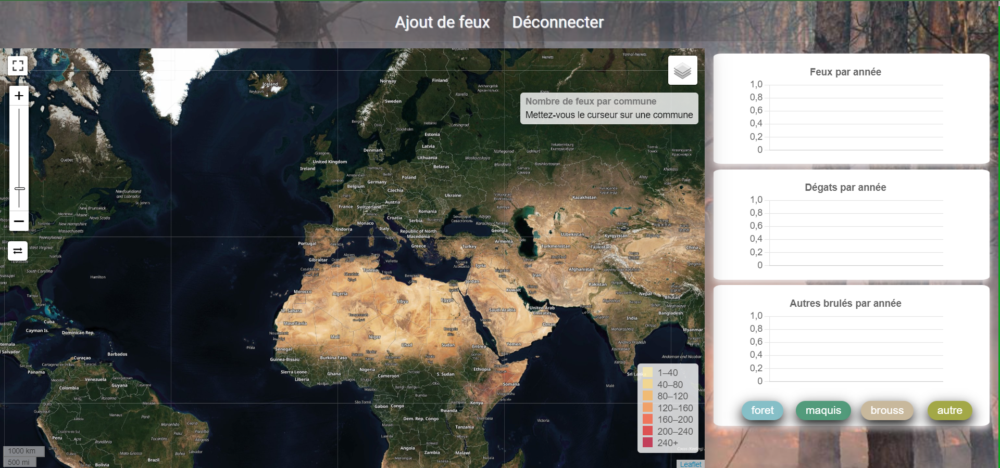
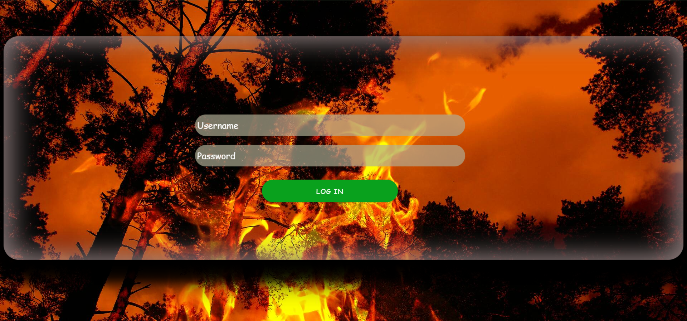

# Description de Projet: Mise en oeuvre d'un SIG pour l'analyse du phénomène des Feux de Forêts 

> Ce projet se rapporte à une expérience très bénifique et instructive qui consiste à mettre en oeuvre un système d'aide à la décision supporté par les SIG.
Ce qu'on appelle aussi la visualisation cartographique, en utilisant des technologies du webmapping après avoir collecter des différentes données décrivant la zone 
d'étude auprès de la conservation de la wilaya de Bouira.
La problématique étudiée dans le projet est née d'un réel besoin exprimé par la direction générale de forêts d'Alger (DGF).

  

## Outils et environnement de développement

       <b> HTML5 </b>
    -- <b> CSS3 </b>
    -- <b> JavaScript </b>
    -- <b> PHP </b>
    -- <b> Leaflet </b>
    -- <b> ChartJs </b>
    -- <b> AJAX   </b>
    -- <b> JQuery  </b>
    -- <b> Json ( GeoJson) </b>
    -- <b> PostgreSQL </b>
    -- <b> PostGIS </b>
    -- <b> Xampp </b>
    -- <b> QGIS </b>

## Ce qu'on peut faire avec l'application ( Les fonctionnalités )
- Visualiser et naviguer sur la carte 
- Afficher les statistiques sous forme graphique (Diagrammes) 
- Afficher les différentes couches ( accès aux différents éléments de l'infra structure forestière ) en naviguant sur la carte et consulter les données de chaque couche sous forme de texte 
- Chercher un lieu dit ( Daira , Commune et Section forestière)
- Ajouter les cordonnées géographiques d'un feu déclanché puis le visualiser sur la map par la suite 

## Présentation des interfaces 
<table align="center">
  <tr> <th> Connexion </th> </tr>
  <tr>
    <td> </td>
  </tr>
</table>
<table align="center">
  <tr> 
         <th > Changer le fond de carte </th>
         <th> Afficher le nombre de feux et les statistiques par commune </th>
  </tr>
  <tr>
    <td>    </td>
    <td>    </td>
  </tr>
  
  <tr> 
         <th colspan="2"> Afficher les couches </th>  
  </tr>
  <tr>
    <td>    </td>
    <td>    </td>
  </tr>
  
  <tr> 
         <th > Chercher un lieu dit </th>
         <th> Afficher les anciens feux</th>
  </tr>
  <tr>
    <td>    </td>
    <td>    </td>
  </tr>
  
   <tr> 
         <th > Ajout de feux </th>
         <th> Afficher les feux ajoutés</th>
  </tr>
  <tr>
    <td>    </td>
    <td>    </td>
  </tr>
</table>

## Base de données

La base de données est conçue à partir des données collectées par la conservation de la wilaya de Bouira sous forme de <b> shapefile </b>, et qui ont nécessité une analyse
et des traitements afin de les implémenter en utilisant <b> PostgreSQL </b> avec son extension <b> PostGIS </b>.  
Le format <b> shapefile </b> permet de stocker les données vectorielles (utilisé très souvent dans les systèmes d'informations géographiques).

<table align="center">
  <tr>
    <th>
    📝 Comme les données sont non partageables donc le fichier de la BD n'est pas disponnible pour tous
    </th>
  </tr>
</table>
